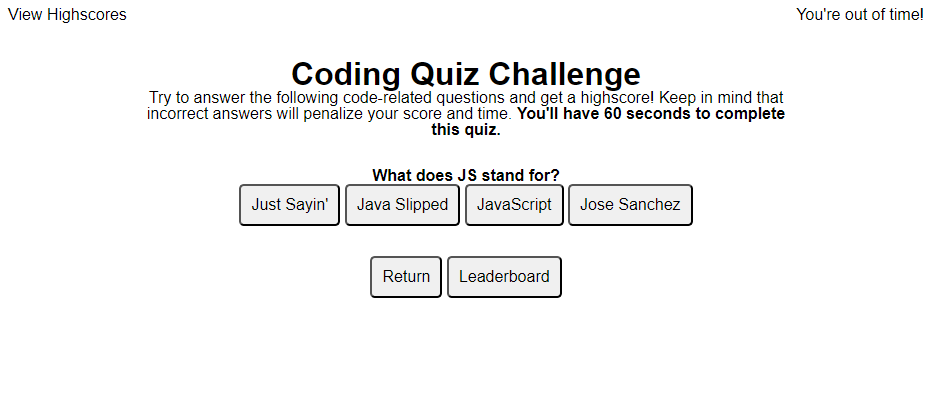
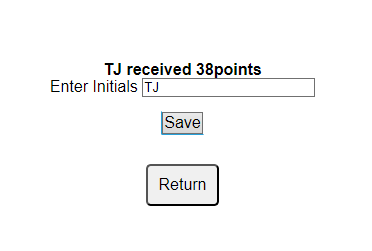

Quiz Challenge was generated as part of the UW coding bootcamp. 

Webpage displays a quiz upon clicking the start button and resets the page with the return button. 

The aim was to satisfy the following acceptance criteria
```
GIVEN I am taking a code quiz
WHEN I click the start button
THEN a timer starts and I am presented with a question
WHEN I answer a question
THEN I am presented with another question
WHEN I answer a question incorrectly
THEN time is subtracted from the clock
WHEN all questions are answered or the timer reaches 0
THEN the game is over
WHEN the game is over
THEN I can save my initials and my score
```


Here is an example of the actual webpage. 


It is possible to save score upon completion of the quiz. The user will be getting with there total points when clicking save. They will also be informed on incompletion is entering points before quiz is completed. 
